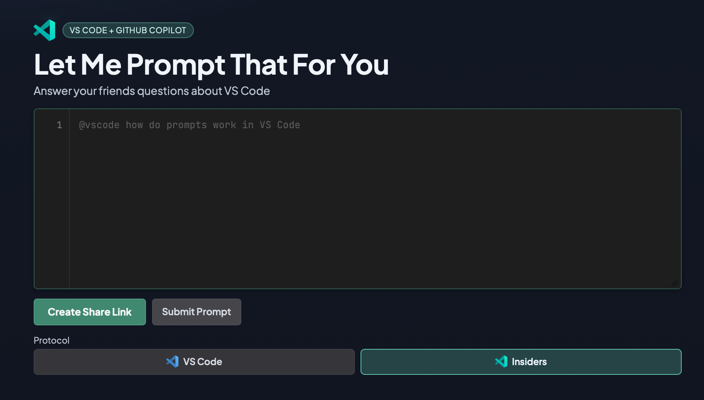

# Let Me Prompt That For You

Answer your friends' questions about VS Code — share a link that types a prompt character-by-character, then opens it in GitHub Copilot Chat.

**Live:** https://pierceboggan.github.io/letmepromptthatforyou/



## How it works

1. Type a prompt (e.g. `@vscode how do I use hooks`)
2. Click **Create Share Link** — the URL is copied to your clipboard
3. Send the link to someone
4. They see the prompt typed out letter-by-letter, then it auto-launches VS Code with the prompt loaded in Copilot Chat

## Features

- **Typing animation** — shared links replay the prompt with a typewriter effect
- **Deep links** — opens `vscode://` or `vscode-insiders://` protocol links directly into Copilot Chat
- **Auto `@vscode` prefix** — ensures prompts always include `@vscode` in the deep link
- **VS Code / Insiders toggle** — switch protocol with logo buttons; the entire UI theme adapts
- **Auto-copy** — share links are copied to clipboard on creation

## Development

```bash
npm install
npm run dev
```

## Deploy

Pushes to `main` auto-deploy to GitHub Pages via the included GitHub Actions workflow.

To deploy manually:

```bash
npm run build
```

Static output is in `./out`.
